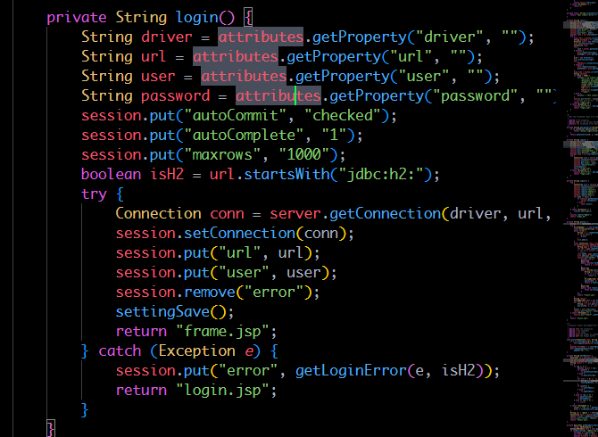
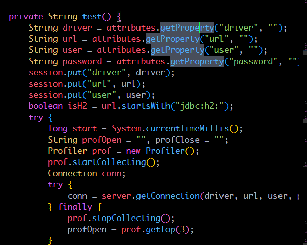
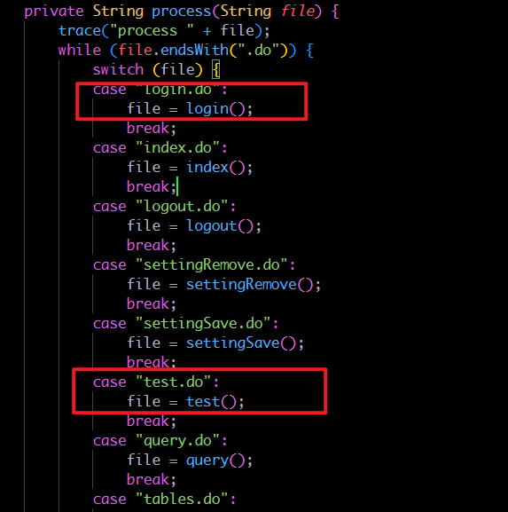

- [cve-2021-42392](#cve-2021-42392)
  - [Source](#source)
  - [Sink](#sink)
  - [Codeql](#codeql)
  - [Result](#result)
# cve-2021-42392
## Source
h2database的source比较单一,主要是从HttpServletRequest中获取到所有参数放入了一个Properties对象中,然后将该Properties赋给Webserver,后续的所有参数都是从该Properties中取得.  
  
本来source的定义是想写成如下
```java
this.getMethod().getName().matches("get%") and this.getMethod().getDeclaringType*().hasQualifiedName("javax.servlet","ServletRequest")
```  
通过ServletRequest的getParameter和getAttribute来定义source,这样写确实能得到http的参数输入,但在后续的数据流污点追踪中,当通过Properties来得到相应的参数时发现污点追踪只能追踪到Properties的get(key)方法,并不能追踪到Properties的getProperty(key,defaultvalue)方法,而该漏洞的漏洞参数正是从getProperty(key,defaultvalue)取得的,导致漏报.  
  
因为其实参数的获取都是从Properties对象中取得,所有直接将source定义为了Properties对象的get相关方法,即如下:  
```java
this.getMethod().getName().matches("get%") and this.getMethod().getDeclaringType*().hasQualifiedName("java.util","Properties")
```
## Sink
Sink即常规的lookup方法.  
```java
this.getMethod().getDeclaringType*().hasQualifiedName("javax.naming", "Context") and this.getMethod().getName() = "lookup"
```
但这样会导致一些误报,因为其实在中途会有一些类型转换,将string转为了int类型,为了保证传入lookup的为string类型所以可以在isAdditionalTaintStep中添加一个限制  
```java
 node1.asExpr() instanceof StringLiteral and 
      node2.asExpr() instanceof StringLiteral
```
来保证数据类型一直为String类型.
## Codeql
```java
/**
 * @kind path-problem
 */

import java
import semmle.code.java.dataflow.FlowSources
import semmle.code.java.dataflow.DataFlow
import DataFlow::PathGraph


class  IfSink extends MethodAccess {
    IfSink(){
       // (this.getCallee().(Constructor).getDeclaringType*().hasQualifiedName("javax.naming", "Context"))
        (this.getMethod().getDeclaringType*().hasQualifiedName("javax.naming", "Context") and this.getMethod().getName() = "lookup")
    }
}
class IfSource extends MethodAccess {
    IfSource(){
        ( this.getMethod().getName().matches("get%") and this.getMethod().getDeclaringType*().hasQualifiedName("javax.servlet","ServletRequest")
        or this.getMethod().getName().matches("get%") and this.getMethod().getDeclaringType*().hasQualifiedName("java.util","Properties"))
    }
}

class MyConf extends TaintTracking::Configuration {
  MyConf() { this = "MyConf" }
  
  override predicate isSource(DataFlow::Node source) {
    exists(IfSource input | source.asExpr() = input.getAnArgument() and input.getAnArgument() instanceof StringLiteral)
  }


  override predicate isSink(DataFlow::Node sink) {
    exists(
        IfSink rawOutput |
        sink.asExpr() = rawOutput.getAnArgument() 
    )
}
override predicate isAdditionalTaintStep(DataFlow::Node node1, DataFlow::Node node2) {
    TaintTracking::localTaintStep(node1, node2) or
    exists(Field f, RefType t | node1.asExpr() = f.getAnAssignedValue() and node2.asExpr() = f.getAnAccess() and
      node1.asExpr().getEnclosingCallable().getDeclaringType() = t and
      node2.asExpr().getEnclosingCallable().getDeclaringType() = t and
      node1.asExpr() instanceof StringLiteral and 
      node2.asExpr() instanceof StringLiteral
    )
  }
}

from MyConf conf, DataFlow::PathNode  source, DataFlow::PathNode  sink
where conf.hasFlowPath(source, sink)
select source, source,sink,sink.toString()
```  
## Result
最后跑出来两条触发路径.
  
一个是login()方法.

一个是test()方法,可以看到其实代码是类似的.
  
所以其实根据路由来看,触发CVE-2021-42392可以从两个接口触发.  
  
一个常规的login.do登录触发,也可以直接请求test.do触发.