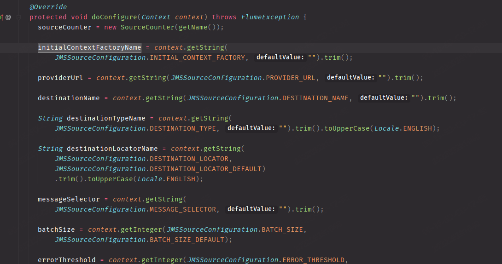
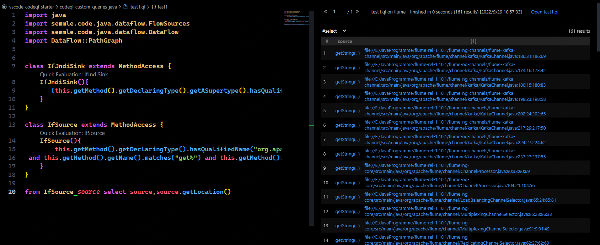

- [CVE-2022-25167](#cve-2022-25167)
  - [Sink](#sink)
  - [Source](#source)
  - [Result](#result)
# CVE-2022-25167
## Sink
Sink即常规的lookup方法.  
```java
class IfJndiSink extends MethodAccess {
    IfJndiSink(){
       (this.getMethod().getDeclaringType().getASupertype().hasQualifiedName("javax.naming", "Context") ) and this.getMethod().getName().matches("lookup")
    }
}
```  
查询如下

分别为flume-ng-sources\flume-jms-source\src\main\java\org\apache\flume\source\jms\JMSSource.java#276行,也就是CVE-2022-25167的触发位置。
，而另一个为flume-ng-sources\flume-jms-source\src\main\java\org\apache\flume\source\jms\JMSMessageConsumer.java#113行即CVE-2022-34916的触发位置。
## Source
在Apache Flume中可控的配置参数都是从Flume自身实现的一个Context类中(org.apache.flume)获取的,所以可以把该Context的get方法作为Source。可以看到Flume从Context中获取参数的方法一般如下:
  

ql实现如下,同时限定了返回类型为String类型,或者直接写为`matches("getString")`.
```java
class IfSource extends MethodAccess {
    IfSource(){
        this.getMethod().getDeclaringType().hasQualifiedName("org.apache.flume", "Context")
 and this.getMethod().getName().matches("get%") and this.getMethod().getReturnType().getName().matches("String")
    }
}
```  
查询结果如下:
  
即全部的Context.getString()方法。 
## Result
最后使用全局追踪，完整的QL如下
```java
/**
 * @kind path-problem
 */
import java
import semmle.code.java.dataflow.FlowSources
import semmle.code.java.dataflow.DataFlow
import DataFlow::PathGraph

class IfJndiSink extends MethodAccess {
    IfJndiSink(){
       (this.getMethod().getDeclaringType().getASupertype().hasQualifiedName("javax.naming", "Context") ) and this.getMethod().getName().matches("lookup")
    }
}
class IfSource extends MethodAccess {
    IfSource(){
        this.getMethod().getDeclaringType().hasQualifiedName("org.apache.flume", "Context")
 and this.getMethod().getName().matches("get%") and this.getMethod().getReturnType().getName().matches("String")
    }
}
class Config extends  TaintTracking::Configuration {
    Config() { this = "Configs" }   
    override predicate isSource(DataFlow::Node source) {
        exists(IfSource input | source.asExpr() = input ) 
       }
    override predicate isSink(DataFlow::Node sink) {
        exists(IfJndiSink rawOutput| sink.asExpr() = rawOutput.getAnArgument() )
    }


}
from Config conf, DataFlow::PathNode  source, DataFlow::PathNode  sink
where conf.hasFlowPath(source, sink)
select source,source,sink,sink.toString()
```  
得到CVE-2022-25167漏洞的执行链。
