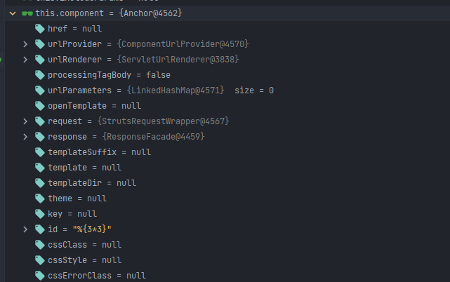
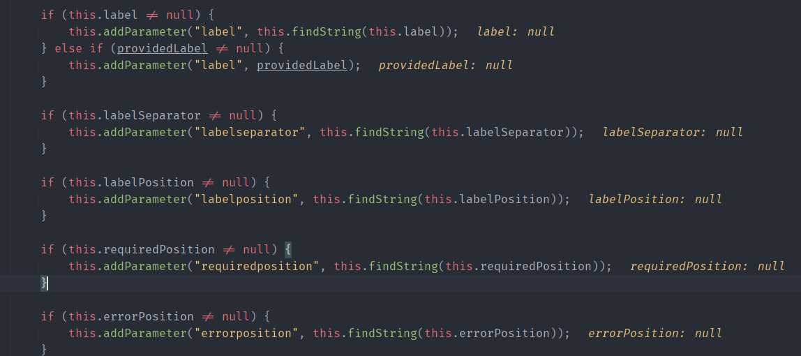

- [CVE-2019-0230(s2-059) Struts2 远程代码执行](#cve-2019-0230s2-059-struts2-远程代码执行)
  - [原理分析](#原理分析)
    - [Struts2标签](#struts2标签)
    - [doStartTag](#dostarttag)
    - [populateComponentHtmlId](#populatecomponenthtmlid)
  - [补丁](#补丁)
  - [参考](#参考)
# CVE-2019-0230(s2-059) Struts2 远程代码执行
## 原理分析
原因是因为Struts2在处理jsp的相关标签时对某些标签的属性会进行两次OGNL表达式执行,如果该属性值可控,则会产生OGNL表达式注入进而RCE.
### Struts2标签
官方文档:https://struts.apache.org/getting-started/using-tags  
要使用Struts2的标签,只需要在JSP页面添加如下一行定义即可：
```jsp
<%@ taglib prefix="s" uri="/struts-tags"%>
```
示例jsp:
```jsp
<%@ page
        language="java"
        contentType="text/html; charset=UTF-8"
        pageEncoding="UTF-8" %>
<%@ taglib prefix="s" uri="/struts-tags" %>
<html>
<head>
    <title>demo</title>
</head>
<s:a id="%{name}">hi</s:a>
</body>
</html>
```
Action  
```java
package test;

import com.opensymphony.xwork2.ActionSupport;

public class IndexAction  extends ActionSupport {
    private String name;
    public String index(){
        System.out.println(getName());
        return SUCCESS;
    }
    public void setName(String name) {
        this.name = name;
    }
    public String getName() {
        return name;
}
```
### doStartTag
传入`name=%{3*3}`  
对标签的处理从`ComponentTagSupport.class#doStartTag`中开始,其中页面中识别到标签类型赋值到`this.component`然后把该component注入容器中,再进入该标签的`populateParams`方法中对标签进行处理.  
  
而在`populateParams`中会调用父类的`populateParams()`,而所有的Tag基本都继承于`AbstractUITag`类,而在`AbstractUITag`中会对各个属性进行赋值,其中就包括id属性.
  
来到`UIbean.class#setId()`中如果id不为空则对id属性调用`this.findString(id)`进行赋值.  
  
而findSting其实就是调用findValue对传入的属性进行一次OGNL表达式求值.  
  
最后解析得到id属性的值为我们传入的参数  

此时uiBean的id属性已经被设置为了`%{3*3}`  

### populateComponentHtmlId
当调用完`populateParams`处理完各个标签属性后开始调用`this.component.start`开始处理页面输出  
  
跟进start会来到其父类`ClosingUIBean.class#start`中,在其中调用了`this.evaluateParams`来计算参数值.  
而在`evaluateParams`中会对各个标签属性进行计算  
  
其中还调用了`this.populateComponentHtmlId`.  

在`populateComponentHtmlId`中如果id属性不为空,且开启`altSyntax`的情况下(默认开启)会再次对id属性值调用`findString`.  
  
最后同样来到`translateVariables`通过`Object o = stack.findValue(parsedValue, asType);`执行OGNL表达式,导致我们输入的字符串被当作OGNL执行.  

## 补丁
添加了沙盒机制黑名单防止RCE.
## 参考
https://securitylab.github.com/research/ognl-apache-struts-exploit-CVE-2018-11776/