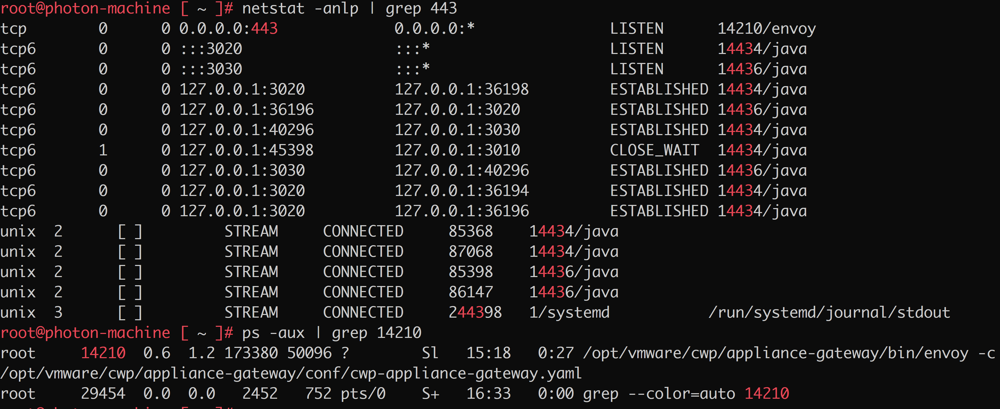
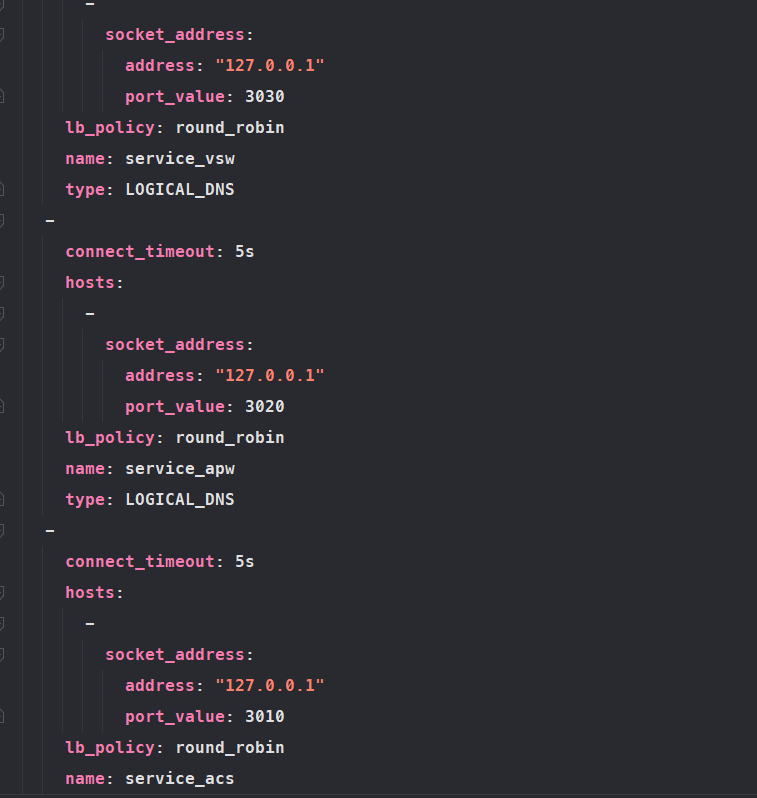
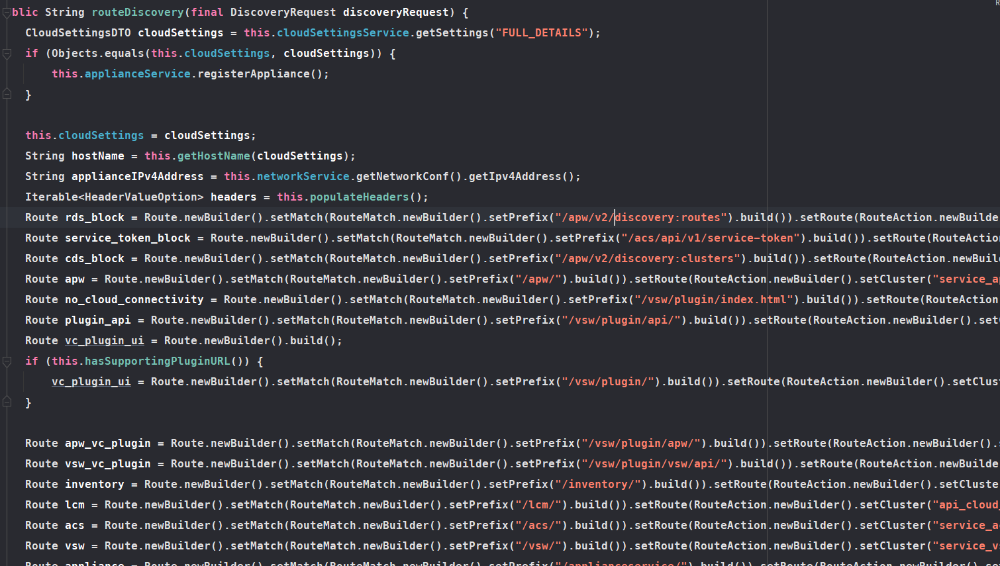
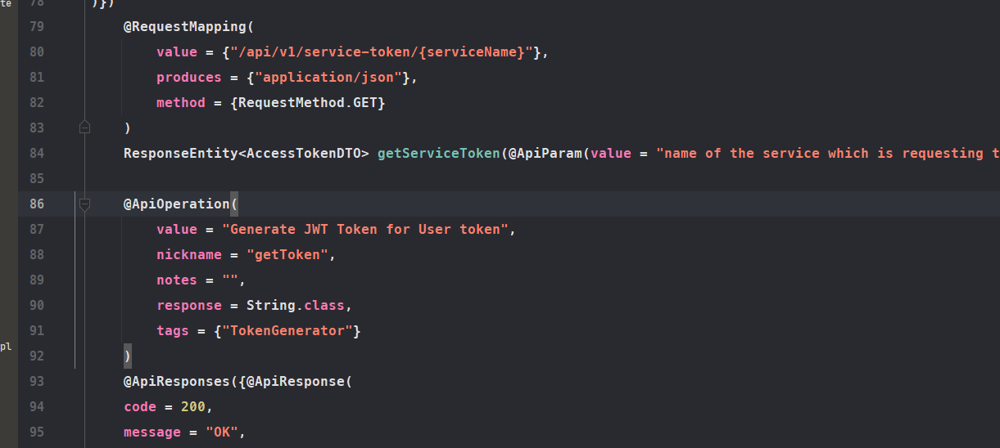
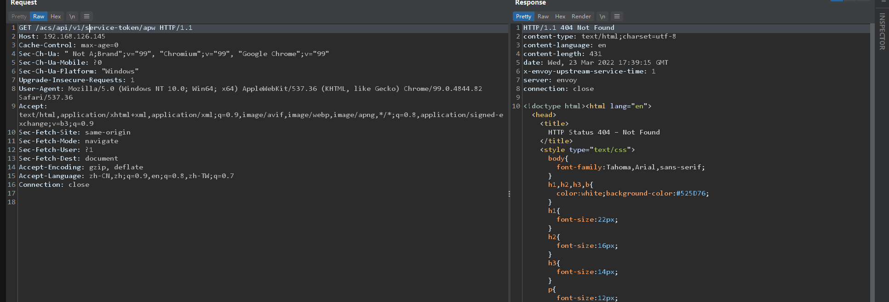

- [CVE-2021-21982 VMware Carbon Black 认证绕过漏洞](#cve-2021-21982-vmware-carbon-black-认证绕过漏洞)
  - [影响版本](#影响版本)
  - [环境搭建](#环境搭建)
  - [原理分析](#原理分析)
    - [envoy](#envoy)
    - [service token](#service-token)
    - [service_vsw Cluster](#service_vsw-cluster)
    - [service_acs Cluster](#service_acs-cluster)
    - [URLEncode](#urlencode)
  - [漏洞复现](#漏洞复现)
  - [补丁](#补丁)
  - [参考](#参考)
# CVE-2021-21982 VMware Carbon Black 认证绕过漏洞
## 影响版本
<=1.0.1
## 环境搭建
直接VMware导入ova文件即可.
## 原理分析
### envoy
envoy是一个类似于nginx的代理转发服务器,启动时的相关配置文件如下在`/opt/vmware/cwp/appliance-gateway/conf/cwp-appliance-gateway.yaml`.

可以看到对本地3030,3010,3020端口都做了代理.

同时envoy支持使用API动态生成转发路由规则,在cwp相关路由实现代码在`EnvoyXDSServiceImpl.class`中.

### service token
在appliance-worker/bin/run.sh启动worker服务时会设置后续请求使用的Service Token,相关命令如下

Token的获取是从端口3010的服务中获取到,在服务器上测试如下.

可以直接得到Token.
服务代码在`TokenGeneratorApi.class`中如下

### service_vsw Cluster
但正常情况下无法直接请求3010端口,需要通过envoy进行代理来请求该端口.
该url的路由规则在`EnvoyXDSServiceImpl.class`中如下:
```java
        Route service_token_block = Route.newBuilder().setMatch(RouteMatch.newBuilder().setPrefix("/acs/api/v1/service-token").build()).setRoute(RouteAction.newBuilder().setCluster("service_vsw").setPrefixRewrite("/no_cloud").build()).build();
```
可以看到对`/acs/api/v1/service-token`请求会被转发到`service_vsw`这个Cluster,而`service_vsw`从`cwp-appliance-gateway.yaml`中可以看到是监听在3030端口的.
### service_acs Cluster
而监听在3010端口的service_acs Cluster路由定义如下
```java
        Route acs = Route.newBuilder().setMatch(RouteMatch.newBuilder().setPrefix("/acs/").build()).setRoute(RouteAction.newBuilder().setCluster("service_acs").setHostRewrite(applianceIPv4Address).build()).build();
```
可以发现两个路由都是以`/acs/`开头,而对`service_vsw Cluster`的路由注册时先于`service_acs Cluster`的,也就是匹配优先级会更高,正常情况下会先转发到`service_vsw Cluster`在3030端口进行处理.
### URLEncode
问题在于Envoy框架默认情况下是不会对请求的URL进行解码,需要在使用`RBAC过滤器`时启用`normalize_path_settings`特性才会对URL进行解码处理.  

当发送`/acs/api/v1/service-token`时将其中一个字符进行URL编码如`/acs/api/v1/%73ervice-token`则会导致对`/acs/api/v1/service-token`路由匹配失败,从而匹配到后面的`/acs/`路由中被直接转发到3010端口的service_acs Cluster中,而从Token的生成可以看到该服务是基础SpringBoot开发,默认是会对url解码从而匹配到对应API接口.
## 漏洞复现


## 补丁
对`acs/api/v1/service-token`的请求增加了`X-RREQUEST-TYPE: INTERNAL`来限制只能本地请求.  
同时在路由中增加了internal路径.
## 参考
https://mp.weixin.qq.com/s/NmOwj1EsT_cRINl2Et7DJA